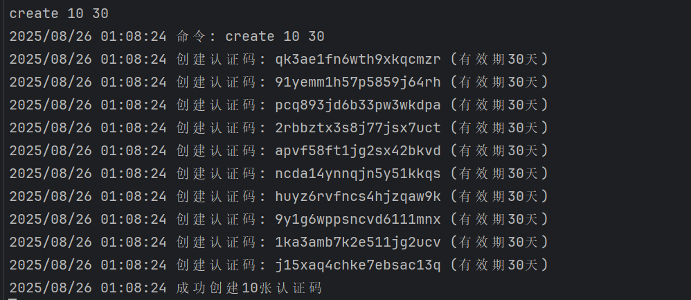

OpenHypixelAccel
===================
开源的，有自助白名单认证系统的，抗ddos的，可计时的Minecraft/我的世界加速方案

## 快速部署

准备一台Windows服务器，打开80与25565端口。  
从release中下载并解压最新版本的zip包。  
运行accel.exe后关闭，编辑config.json，修改"enable_auth_api"为true。  
运行accel.exe与auth_api.exe。  
在auth_api.exe窗口输入create并按提示生成认证码即可。

## 认证界面预览

## 在哪里找vps

我们推荐hostloc的offer板块。其中不乏便宜大碗的选择，例如cuidc的CTG年付仅200r，对于5-10人同时在线都是绰绰有余的。  
https://hostloc.com/forum-77-1.html

## 免责声明

使用本项目即表示您完全理解并承诺：

1. 本项目仅限个人非商业用途，禁止用于经营性加速服务。
2. 您需确保使用行为符合《中华人民共和国网络安全法》《数据安全法》等法律法规并自行承担全部法律风险。如需将本项目用于公开网络服务，须自行办理
   ICP备案、公安备案等法定手续。
3. 技术上本项目仅能加速我的世界，无法加速其他任何游戏、软件或网络服务；任何声称可加速其他服务的修改行为均违反本项目设计初衷。
4. 本项目为开源实验性工具，可能存在未知安全漏洞（包括但不限于数据泄露、连接中断、协议冲突等风险）； 作者不保证项目运行的稳定性、安全性及兼容性；
   因使用本项目导致的任何直接/间接损失（包括游戏账号封禁、数据丢失、网络故障等），作者及贡献者均不承担法律责任。
5. 不得对本项目进行恶意修改，严禁使用本项目进行违法活动。

本项目不包含《我的世界》游戏内容，所有游戏相关知识产权归 Mojang Studios 及网易公司（中国版）所有；  
《我的世界》（Minecraft）是合法的电子游戏，中国代理商为网易公司，版号为沪网文[2016]3825-278号。  
技术实现仅针对网络传输层优化，不涉及游戏客户端修改，不提供任何作弊功能； 项目代码遵循MIT开源，禁止用于侵犯他人权益的用途。
